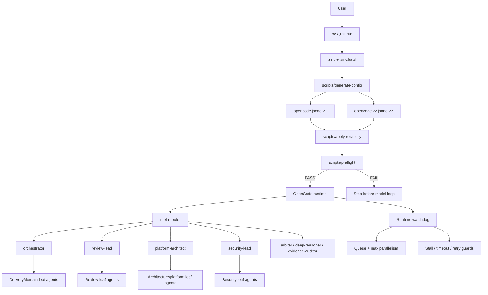
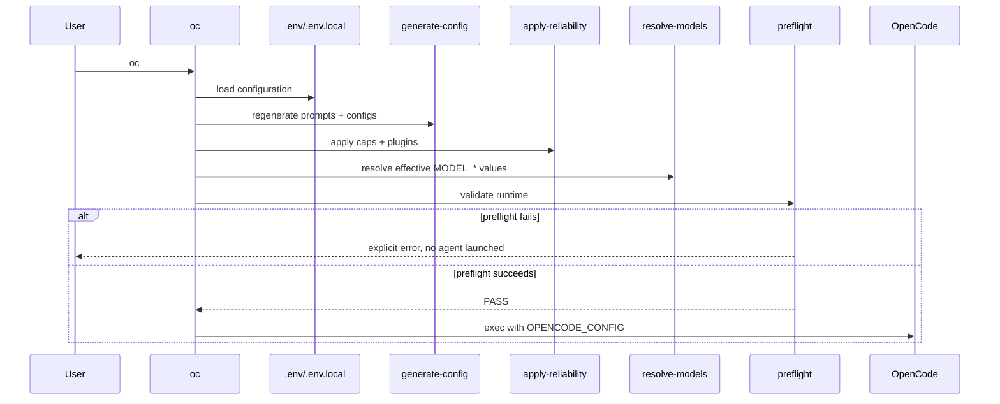
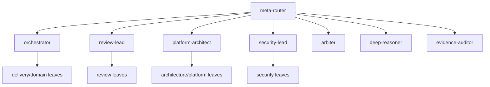
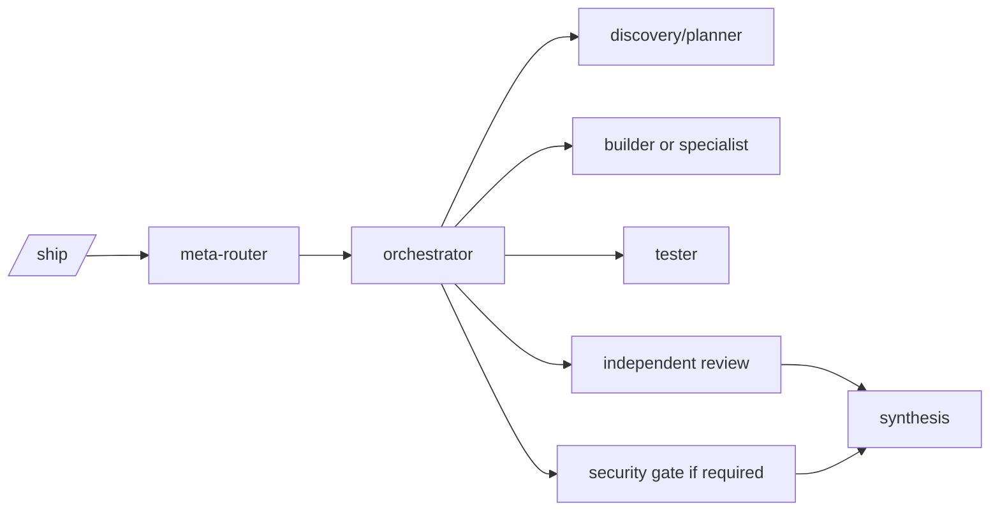
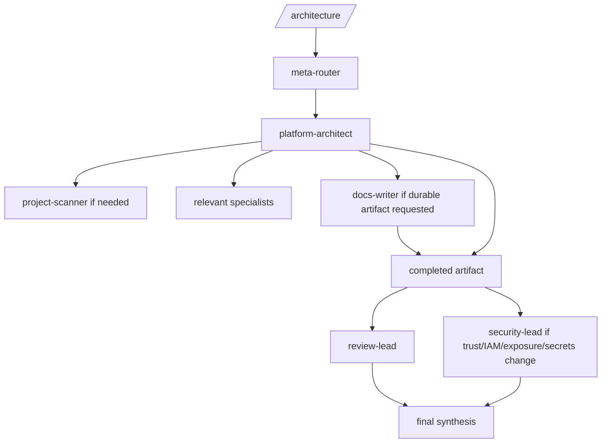
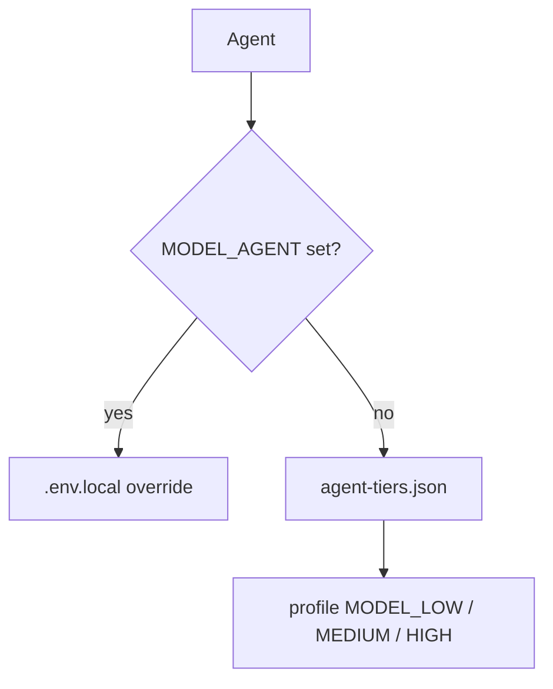
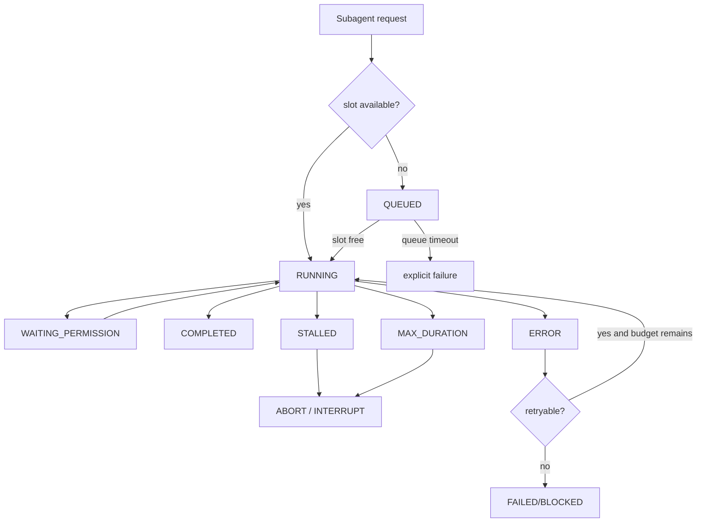

# OpenCode Agent Toolkit system architecture

> This document describes the **internal architecture of the toolkit itself**: how it boots, generates configuration, routes a request, launches and supervises subagents, applies guardrails, and produces verifiable handoffs.
>
> It complements `ARCHITECTURE.md`, which focuses on how the agents design and independently review a target architecture for a project.

## 1. Design goals

The toolkit is designed as a **controlled multi-agent runtime**, not as a collection of independent prompts.

Primary goals:

1. **Explicit hierarchy**: the user enters through a single control point; leads orchestrate; leaf agents execute.
2. **Bounded delegation**: shallow depth, allowlisted child catalogs, and leaf agents that cannot delegate.
3. **Evidence first**: material decisions and claims should map to files, commands, logs, metrics, plans, or other verifiable sources.
4. **Independent review**: a producing path does not certify its own work alone.
5. **Provider agnostic**: agents express capability tiers rather than hard-coded providers/models.
6. **Deterministic reliability**: step, concurrency, retry, duration, and stall limits are enforced by code, not only by prompts.
7. **Fail fast**: auth, model, configuration, or plugin problems should fail before the first expensive model loop whenever they are locally detectable.
8. **Layered cost bounding**: steps, duration, retries, depth, and concurrency reduce runaway spend even without authoritative monetary telemetry.

---

## 2. System overview



The toolkit therefore has two complementary planes:

- the **agent control plane**, which decides who should do the work;
- the **runtime guard plane**, which decides how many agents may run, for how long, and how often failures may retry.

The first plane is governed by prompts and permissions. The second is intentionally deterministic.

---

## 3. Repository component map

| Path | Responsibility |
|---|---|
| `agents/manifest.json` | Functional source of truth for agent roles, methods and role-specific constraints |
| `scripts/generate-config` | Generates prompts and OpenCode V1/V2 configuration from a common source |
| `prompts/` | Generated runtime prompts |
| `profiles/agent-tiers.json` | Agent -> `low` / `medium` / `high` capability tier mapping |
| `profiles/*.env.example` | Capability tier -> concrete provider model mapping |
| `.env` | Active profile and main local configuration |
| `.env.local` | Persistent local overrides, including per-agent model and runtime limits |
| `scripts/resolve-models` | Resolves effective models for all agents |
| `reliability.json` | Versioned reliability defaults: steps, concurrency, timeouts and retries |
| `scripts/apply-reliability` | Post-processes generated configuration with caps and plugin wiring |
| `.opencode/plugins/reliability-v1.js` | V1 runtime watchdog/guards |
| `.opencode/plugins/reliability-v2.ts` | V2 runtime watchdog/guards |
| `scripts/preflight` | Deterministic checks before OpenCode starts |
| `scripts/opencode-agents` | `oc` / `just run` launcher |
| `contracts/*.schema.json` | Machine-readable routing and handoff contracts |
| project scanner scripts | Multi-repository discovery and architecture inventory |
| `docs/` | User, routing, model, security, reliability and architecture documentation |
| `tests/` | Generation, permission, installation, profile and reliability invariants |

### Generated files are not the source of truth

`prompts/`, `opencode.jsonc`, and `opencode.v2.jsonc` are derived artifacts.

```text
manifest + policies + profiles
          |
          v
  generate-config
          |
          v
 prompts + raw OpenCode configs
          |
          v
  apply-reliability
          |
          v
 effective runtime configs
```

Change the appropriate source rather than manually patching generated configuration.

---

## 4. Boot lifecycle: what happens when `oc` is executed

`scripts/opencode-agents` preserves the current project working directory and resolves the real toolkit root even when `oc` is installed as a symlink in `~/.local/bin`.



### 4.1 Configuration loading

Override order:

```text
.env
  ↓
.env.local
```

`.env.local` wins and preserves personal choices outside tracked defaults.

### 4.2 Generation

`scripts/generate-config`:

- reads `agents/manifest.json`;
- builds structured prompts;
- injects common policies;
- configures permissions and delegation allowlists;
- bounds subagent depth;
- emits both V1 and V2 from one logical source.

### 4.3 Reliability post-processing

`scripts/apply-reliability`:

- reduces raw `steps` using `reliability.json` or environment overrides;
- wires the correct V1/V2 watchdog plugin;
- adds child-supervision rules to lead prompts;
- aligns prompt-level concurrency guidance with runtime enforcement.

### 4.4 Model resolution

Agent roles do not embed concrete model IDs. Model resolution is a separate layer described in section 10.

### 4.5 Preflight

Preflight attempts to detect before the model loop:

- missing OpenCode binary;
- missing or invalid JSON config;
- missing or unwired watchdog plugin;
- invalid reliability values;
- empty model tiers;
- explicitly missing credentials;
- configured models absent from `opencode models`;
- unusual Git state.

Preflight does not replace runtime checks because some provider failures are only observable on the first real request.

---

## 5. Agent control plane

The toolkit contains 37 agents, but only a small set forms the control plane.



### `meta-router`

Classifies the request and selects one primary path. It intentionally sees a small catalog of leads and escalation agents instead of a flat list of 37 specialists.

Routing dimensions include domains, complexity, risk, uncertainty, blast radius, change type, required gates, and escalation triggers.

### `orchestrator`

Owns multi-step delivery, implementation, debugging and incident workflows. It selects relevant specialists and consumes their handoffs.

### `review-lead`

Builds an **adaptive independent review** based on the changed surface.

### `platform-architect`

Owns Platform architecture and design, evidence gathering, specialist selection, design stabilization, and durable documentation delegation to `docs-writer` when needed.

### `security-lead`

Selects only relevant security gates: threat model, AppSec, IaC security, supply-chain, secrets, or explicitly authorized pentesting.

### Escalation agents

- `arbiter`: resolves material disagreement between credible conclusions;
- `deep-reasoner`: handles hard-to-reverse, high-risk, or persistently low-confidence decisions;
- `evidence-auditor`: checks weakly supported claims of success.

---

## 6. Delegation invariants

### Maximum intended depth

```text
meta-router -> lead/orchestrator -> leaf
```

The intended maximum delegation depth is **2**.

### Leaf agents never delegate

Every leaf has explicit deny-all `task` / `subagent` permissions. Only control agents receive child allowlists.

### Leads do not fan out just because a technology exists

Terraform, Kubernetes, AWS, SQL, or Go files alone do not justify launching every matching specialist.

A child should add distinct value: required expertise, broad/specialized evidence collection, implementation/testing ownership, an independent gate, or resolution of a material risk/disagreement.

### Complete handoffs are reused

An equivalent child task should not be re-dispatched after a `COMPLETE` handoff unless evidence is incomplete, stale, contradictory, or scope has materially changed.

---

## 7. Main workflows

### 7.1 Delivery `/ship`



The exact path is risk- and scope-dependent. A small local change should not fan out like a Platform migration.

### 7.2 Architecture `/architecture`



The producing path never acts as the sole final independent reviewer of its own artifact.

### 7.3 Review `/review`

`review-lead` re-establishes required evidence and selects only relevant dimensions: code, API contract, performance, database, AWS, Kubernetes, networking, AppSec, IaC security, and so on.

### 7.4 Security `/security`

`security-lead` adapts gates to the changed attack surface. Pentesting requires explicit authorization and remains scoped/non-destructive.

---

## 8. Agent-to-agent data contracts

Subagents should not return unstructured prose that is hard for a parent to consume.

### Routing Decision

The routing contract includes domains, complexity, risk, uncertainty, blast radius, change type, route, gates, escalation triggers and optionally parallelizable work.

### Agent Handoff

A delegated agent ends with:

- `STATUS`: COMPLETE / BLOCKED / ESCALATION_REQUIRED;
- `SUMMARY`;
- `FACTS`;
- `ASSUMPTIONS`;
- `EVIDENCE`;
- `FINDINGS`;
- `RESIDUAL RISKS`;
- `RECOMMENDED NEXT AGENTS`;
- `CONFIDENCE`.

The parent consumes that result rather than redoing the entire analysis.

---

## 9. Evidence discipline

The toolkit systematically separates:

```text
FACTS
ASSUMPTIONS
RECOMMENDATIONS
```

Evidence may include file/line references, command outputs, test results, Terraform/OpenTofu/Terragrunt plans, logs, metrics, external sources, or generated artifacts.

Agents must not claim a test, plan, runtime check, or source lookup succeeded without evidence.

This matters especially in a multi-agent system because a weak discovery result may otherwise become an implicit assumption for several downstream agents.

---

## 10. Model abstraction

Agent role and model power are deliberately separated.

### Three capability tiers

```text
LOW
MEDIUM
HIGH
```

Agent -> tier lives in `profiles/agent-tiers.json`. A provider profile then defines `MODEL_LOW`, `MODEL_MEDIUM`, and `MODEL_HIGH`.

### Resolution



Effective order:

```text
MODEL_<AGENT>
    ↓ otherwise
agent tier
    ↓
MODEL_LOW / MODEL_MEDIUM / MODEL_HIGH
```

This allows changing provider/profile without rewriting 37 agent definitions.

---

## 11. Runtime guard plane



### Maximum parallelism

`MAX_PARALLEL_SUBAGENTS` limits active children **per parent**. Default: `3`.

When all slots are occupied, the next launch waits in a deterministic runtime queue instead of immediately consuming another model call.

### Queue timeout

`SUBAGENT_QUEUE_TIMEOUT_SECONDS` prevents the queue itself from becoming an indefinite hang. Default: `600s`.

### Slot reservations

Pending launches reserve capacity to avoid a race where several simultaneous calls all observe a free slot and exceed the configured limit.

### Stall detection

The watchdog tracks both activity and material progress. An agent can therefore be active without making progress.

### Permission waiting

`WAITING_PERMISSION` is explicitly excluded from stall detection so a legitimate human approval wait is not killed.

### Maximum duration

`SUBAGENT_MAX_DURATION_SECONDS` interrupts a child that exceeds its duration budget. Default: `900s`.

### Repeated errors

V1 normalizes runtime/tool errors and can stop a child when the same root cause repeats beyond the configured budget.

### V2 provider retry policy

```text
400 / 401 / 403 / 404 -> terminal
429                  -> bounded retry
5xx                  -> bounded retry
```

This prevents deterministic configuration/auth failures from spending repeated reasoning cycles.

---

## 12. Step caps

OpenCode `steps` remain a fundamental barrier even with the watchdog.

`generate-config` emits raw values, then `apply-reliability` applies more conservative caps from `reliability.json`.

Typical defaults:

| Agent | Cap |
|---|---:|
| `meta-router` | 12 |
| `orchestrator` | 16 |
| `platform-architect` | 14 |
| `review-lead` | 12 |
| `security-lead` | 12 |
| `builder` | 16 |
| `terraform-terragrunt` | 14 |
| `tester` | 12 |
| fallback | 10 |

Per-agent overrides are supported, for example:

```bash
MAX_STEPS_ORCHESTRATOR=12
MAX_STEPS_BUILDER=14
```

The barriers are complementary:

- steps bound iterations;
- watchdog bounds time and stagnation;
- retry policy bounds provider failures;
- queue bounds concurrency;
- delegation depth bounds recursive fan-out.

---

## 13. Security model

Security is layered.

### Least privilege by role

Permissions are generated per agent. A reviewer and builder intentionally have different capabilities.

### Sensitive file reads

Common `.env`, private key, SSH and AWS credential paths are explicitly denied to agent readers.

### Destructive infrastructure operations

For Terraform/OpenTofu/Terragrunt, apply/destroy operations are denied by default; validation/formatting and controlled planning are treated separately.

### Non-editing review

Review/security roles should not silently modify the code they audit.

### Pentesting

Pentesting must be explicitly authorized, scoped and non-destructive.

### Delegation allowlists

A lead can only invoke declared children; leaves cannot bypass the control plane.

---

## 14. Multi-repository discovery

The toolkit can inspect projects below `PROJECTS_ROOT`, defaulting to `$HOME/Projects`.

`project-scanner` is specifically allowed to read that area while sensitive-path exclusions still apply.

The inventory aims to capture components, languages, interfaces, infrastructure, AWS resources, data stores, relationships, file/line evidence and confidence.

That inventory becomes architecture input instead of forcing the architecture lead to rediscover every repository manually.

---

## 15. Failure modes and expected behavior

| Failure mode | Expected reaction |
|---|---|
| OpenCode binary missing | preflight FAIL |
| Watchdog missing/unwired | preflight FAIL |
| `0 credentials` | preflight FAIL |
| Configured model absent from `opencode models` | preflight FAIL |
| Provider 401/403 | stop; no retry loop |
| Temporary 429/5xx | bounded retry |
| Child has no progress | watchdog interrupt |
| Child exceeds duration | watchdog interrupt |
| Child waits for permission | WAITING_PERMISSION; no stall kill |
| Too many children | runtime queue |
| Queue waits too long | explicit timeout |
| Equivalent task already COMPLETE | reuse handoff |
| Material disagreement | `arbiter` |
| High-risk / low-confidence decision | `deep-reasoner` |
| Weak success evidence | `evidence-auditor` |

---

## 16. Checkpoints and logical recovery

The toolkit encourages clear phase boundaries:

```text
discovery -> plan -> implementation -> tests -> independent review -> security gate
```

A blocked child should return a `BLOCKED` handoff containing evidence already collected.

The orchestrator then makes one decision: fix the prerequisite, route once to a distinct specialist, or stop and surface the blocker.

The toolkit does not yet provide a universal transactional workflow engine that can resume arbitrary workflows after process restart; handoffs and durable artifacts are the current logical recovery boundary.

---

## 17. Runtime observability

The watchdog primarily maintains in-memory state from OpenCode events: known sessions, parent/child relationships, activity/progress timestamps, status, permission waits, repeated errors and slot reservations.

A natural future extension is structured per-run telemetry with agent, parent, model, timings, status, steps, retries, queue wait, abort reason and authoritative token/cost telemetry when available.

---

## 18. Cost control

Cost is currently bounded through:

1. minimum sufficient routing;
2. delegation depth <= 2;
3. no leaf delegation;
4. step caps;
5. maximum parallelism;
6. bounded queue;
7. maximum duration;
8. stall timeout;
9. bounded retries;
10. reuse of complete handoffs;
11. configurable model tiers.

### Why there is no universal `MAX_COST_EUR` yet

A correct monetary hard stop requires authoritative per-request cost data. Providers/profiles do not necessarily expose that uniformly.

The toolkit therefore prefers enforceable measured limits over pretending an uncertain estimate is a guaranteed monetary cap.

---

## 19. Adding an agent without breaking the architecture

Recommended sequence:

1. Add the role to `agents/manifest.json`.
2. Decide whether it is a lead or leaf; default to leaf.
3. Keep leaf delegation denied.
4. Add the child only to leads that materially need it.
5. Assign a tier in `profiles/agent-tiers.json`.
6. Add a model override only when justified.
7. Grant minimum shell/edit/web/skill permissions.
8. Add a step cap to `reliability.json` if the fallback is inappropriate.
9. Regenerate with `just config`.
10. Add/update invariant tests.
11. Update agent documentation if topology materially changes.

Avoid turning specialists into mini-orchestrators just for autonomy; it breaks the shallow hierarchy and makes cost harder to bound.

---

## 20. Adding or changing a provider/model

The profile is the extension boundary, not the agent manifest.

```text
new provider
      ↓
profiles/<provider>.env.example
      ↓
MODEL_LOW / MODEL_MEDIUM / MODEL_HIGH
      ↓
37 unchanged agent roles
```

Per-agent exceptions belong in `.env.local`.

---

## 21. Changing reliability policy

Change `reliability.json` for versioned defaults. Use `.env.local` for personal overrides.

Validation commands:

```bash
just reliability
just preflight
just doctor
just check
```

---

## 22. Tested architecture invariants

Tests act as architecture guards, not only unit tests. They cover V1/V2 agent parity, bounded depth, no leaf delegation, sensitive permissions, edit rights, destructive Terraform denial, prompt contracts, delegation economy, reliability caps, watchdog wiring, queue/timeout presence, symlink launcher behavior and model-profile parity.

A change that violates a control-plane invariant should therefore fail CI.

---

## 23. Known limitations

1. No universal monetary hard stop yet because provider cost telemetry is not uniform.
2. Progress detection is heuristic; available events do not perfectly encode useful work.
3. V1 and V2 require separate watchdog implementations because their runtime APIs/events differ.
4. The queue is in-process, not a persistent distributed scheduler.
5. Handoffs provide logical recovery, not a fully durable transactional workflow engine.
6. Preflight can only validate locally observable conditions; provider failures may still occur after launch.
7. High configured parallelism can remain expensive even when technically controlled.

---

## 24. Recommended code-reading order

```text
1. docs/en/SYSTEM_ARCHITECTURE.md
2. agents/manifest.json
3. scripts/generate-config
4. profiles/agent-tiers.json
5. reliability.json
6. scripts/apply-reliability
7. scripts/opencode-agents
8. scripts/preflight
9. .opencode/plugins/reliability-*
10. contracts/*.schema.json
11. tests/
```

Then use the focused documents: `AGENTS.md`, `ROUTING.md`, `MODEL_STRATEGY.md`, `RELIABILITY.md`, `SECURITY.md`, `ARCHITECTURE.md`, and `PROJECT_DISCOVERY.md`.

---

## 25. One-page mental model

```text
                       USER
                        |
                        v
                  oc / just run
                        |
         +--------------+--------------+
         |                             |
         v                             v
  config/model pipeline         reliability pipeline
         |                             |
         +--------------+--------------+
                        |
                     preflight
                        |
                        v
                     OpenCode
                        |
                        v
                   meta-router
                        |
        +---------------+---------------+
        |               |               |
        v               v               v
  orchestrator    platform-architect  review/security
        |               |               |
        +---------------+---------------+
                        |
                   leaf agents
                        |
                        v
                 evidence + handoff

Runtime around all of it:
- depth <= 2
- leaf delegation = deny
- capped steps
- max N active children
- deterministic queue
- queue timeout
- stalled timeout
- max duration
- bounded retries
- WAITING_PERMISSION != STALLED
- independent review
```

The guiding principle is:

> **LLMs choose and perform engineering work; deterministic code controls their boundaries, concurrency, retries and duration.**
