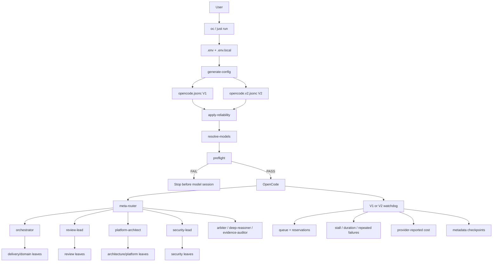
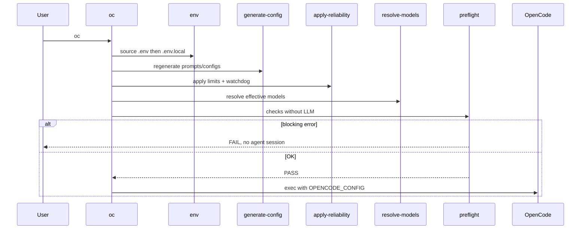
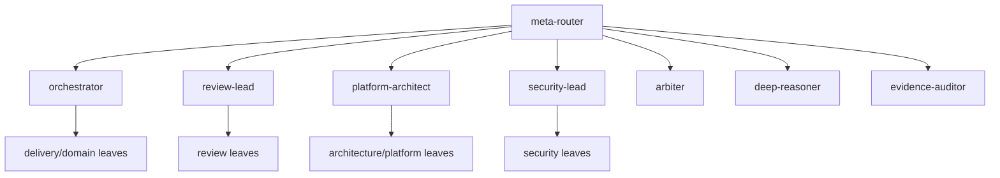
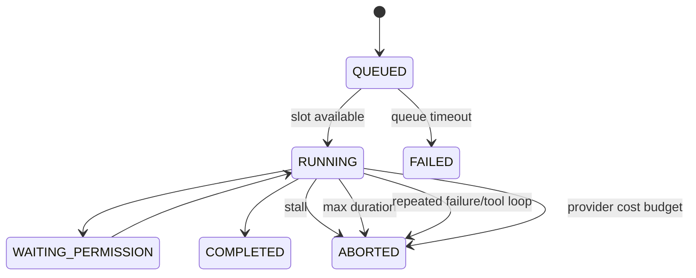

# OpenCode Agent Toolkit system architecture

> This document describes the **internal architecture of the toolkit itself**: boot, configuration generation, routing, agent hierarchy, models, subagent supervision, cost guardrails, and logical recovery.
>
> `ARCHITECTURE.md` describes a different topic: how the agents design and independently review a project's architecture.

## 1. Core idea

The toolkit is a **controlled multi-agent runtime**, not a collection of independent prompts.

```text
              OpenCode Agent Toolkit
                       |
          +------------+------------+
          |                         |
          v                         v
  AGENT CONTROL PLANE       RUNTIME GUARD PLANE
          |                         |
   Who does what?           How many / how long /
                            how many retries?
          |                         |
   meta-router                 preflight
   orchestrator                step caps
   review-lead                 watchdog
   architect                   queue
   security                    max parallel
                               timeouts
                               cost guards
                               checkpoints
```

**LLMs decide engineering work. Deterministic code decides their operational boundaries.**

Primary goals:

1. explicit, shallow hierarchy;
2. allowlisted delegation;
3. leaf agents that cannot delegate;
4. evidence-driven decisions;
5. independent reviews;
6. provider-agnostic capability tiers;
7. fail fast before the first expensive model call when possible;
8. bounded steps, duration, retries, depth, and concurrency;
9. useful metadata preservation after aborts;
10. monetary enforcement only from actually reported telemetry.

---

## 2. System overview



---

## 3. Repository sources of truth

| Path | Responsibility |
|---|---|
| `agents/manifest.json` | functional agent definitions |
| `scripts/generate-config` | compile manifest/policies into prompts and V1/V2 configs |
| `profiles/agent-tiers.json` | agent -> `LOW` / `MEDIUM` / `HIGH` |
| `profiles/*.env.example` | capability tiers -> concrete models |
| `.env` | primary local profile/configuration |
| `.env.local` | persistent personal overrides |
| `reliability.json` | versioned runtime profiles and limits |
| `scripts/apply-reliability` | step caps, watchdog wiring, lead supervision |
| `.opencode/plugins/reliability-v1.js` | OpenCode V1 runtime guard plane |
| `.opencode/plugins/reliability-v2.ts` | OpenCode V2 runtime guard plane |
| `scripts/preflight` | zero-token checks before launch |
| `contracts/*.schema.json` | routing and handoff contracts |
| `tests/` | executable system invariants |

`prompts/`, `opencode.jsonc`, and `opencode.v2.jsonc` are **generated artifacts**, not the primary files to edit.

```text
manifest + profiles + policies
             |
             v
       generate-config
             |
             v
    prompts + raw configs
             |
             v
      apply-reliability
             |
             v
      effective configs
```

---

## 4. What happens when you run `oc`

`scripts/opencode-agents` is the operational entry point.



The launcher resolves its real toolkit path even when invoked through `~/.local/bin/oc`, while preserving the current project directory as the OpenCode workspace.

Override order:

```text
.env
  ↓
.env.local
```

`.env.local` wins and is the place for personal model, reliability, concurrency, and timeout overrides.

---

## 5. Agent control plane

The toolkit contains 37 agents, but only a small set forms the control plane.



### `meta-router`

Classifies the request and selects the primary route. It intentionally does not see a flat catalog of all 37 specialists.

### `orchestrator`

Runs multi-step delivery, fixes, debugging, and incidents.

### `review-lead`

Selects independent review dimensions based on the actual change surface.

### `platform-architect`

Leads architecture work and selects only relevant Platform specialists.

### `security-lead`

Selects the necessary security gates: threat modeling, AppSec, IaC security, supply chain, secrets, authorized pentest, and so on.

### Escalation agents

- `arbiter`: credible but materially conflicting conclusions;
- `deep-reasoner`: high-risk, hard-to-reverse decisions or persistently low confidence;
- `evidence-auditor`: success claims without enough supporting evidence.

---

## 6. Delegation invariants

### Depth

```text
meta-router -> lead/orchestrator -> leaf
```

Intended maximum depth: **2**.

### Leaf agents

Leaf agents explicitly deny `task` / `subagent` delegation.

```text
builder -> tester        NO
terraform -> aws         NO
reviewer -> appsec       NO
```

Coordination stays in the control plane.

### Minimum sufficient delegation

Finding Terraform, Go, Kubernetes, or AWS files is not enough reason to launch every matching specialist. A child must add distinct value.

### Reusable handoffs

A `COMPLETE` handoff should not be recomputed unless evidence is stale, incomplete, contradictory, or the scope materially changed.

---

## 7. Main workflows

### Delivery `/ship`

```text
meta-router
    ↓
orchestrator
    ├─ discovery/planner when needed
    ├─ builder or specialist
    ├─ tester
    ├─ independent review
    └─ security gate when relevant
```

### Architecture `/architecture`

```text
platform-architect
    ├─ project-scanner when needed
    ├─ relevant Platform specialists
    └─ docs-writer for durable artifact
              ↓
        completed artifact
          ├─ review-lead
          └─ security-lead when required
```

A producer never certifies its own architecture alone.

### `/review`

`review-lead` rebuilds evidence and selects code/API/performance/database/AWS/Kubernetes/networking/security dimensions based on the real change.

### `/security`

`security-lead` adapts gates to risk. Pentesting must be explicitly authorized, scoped, and non-destructive.

---

## 8. Agent-to-agent contracts

Two machine-readable contracts live under `contracts/`.

### Routing decision

Describes domains, complexity, risk, uncertainty, blast radius, change type, route, gates, escalation triggers, and parallelizability.

### Agent handoff

A child distinguishes:

```text
STATUS
SUMMARY
FACTS
ASSUMPTIONS
EVIDENCE
FINDINGS
RESIDUAL RISKS
RECOMMENDED NEXT AGENTS
CONFIDENCE
```

The parent consumes the handoff instead of restarting analysis from scratch.

---

## 9. Evidence discipline

The toolkit separates:

```text
FACTS
ASSUMPTIONS
RECOMMENDATIONS
```

Evidence can be a file/line reference, command output, test result, Terraform plan, log, metric, external source, or generated artifact.

This matters especially in a multi-agent system: a bad early assumption can otherwise be amplified by multiple downstream agents.

---

## 10. Model abstraction

Agents express a **capability tier**, not a hard-coded provider.

```text
MODEL_<AGENT> override
        ↓ otherwise
profiles/agent-tiers.json
        ↓
MODEL_LOW / MODEL_MEDIUM / MODEL_HIGH
```

Changing from Copilot to Codex/OpenAI or another provider therefore does not require rewriting the 37 agent definitions.

Preflight checks the **models actually resolved for agents**, including `{env:MODEL_*}` placeholders in generated configs.

---

## 11. Runtime guard plane

V1 and V2 have version-specific watchdog implementations but target the same semantics.



Each child session is tracked independently from its root session.

---

## 12. Reliability profiles

`reliability.json` defines three profiles:

| Profile | Parallel | Queue | Stall | Child duration | Retries | Child cost* | Run cost* |
|---|---:|---:|---:|---:|---:|---:|---:|
| `cheap` | 2 | 300s | 120s | 600s | 1 | 0.25 | 1.00 |
| `normal` | 3 | 600s | 180s | 900s | 2 | 0.50 | 2.00 |
| `premium` | 4 | 900s | 240s | 1200s | 2 | 1.50 | 5.00 |

`*` = value reported by OpenCode/provider in its native unit.

```bash
RELIABILITY_PROFILE=normal
```

Explicit `.env.local` values override profile defaults.

---

## 13. Parallelism and queueing

Global limit:

```bash
MAX_PARALLEL_SUBAGENTS=3
```

Per-lead overrides:

```bash
MAX_PARALLEL_META_ROUTER=2
MAX_PARALLEL_ORCHESTRATOR=3
MAX_PARALLEL_REVIEW_LEAD=3
MAX_PARALLEL_PLATFORM_ARCHITECT=3
MAX_PARALLEL_SECURITY_LEAD=2
```

If a lead-specific value is unset, the global value applies.

### Why reservations exist

The runtime must prevent two opposite problems:

1. **race**: simultaneous launches all observe the same free slot;
2. **double counting**: a launch becomes an active child while still counted as pending.

Current flow:

```text
tool delegation
     ↓
reservation(callID)
     ↓
child appears through event or session.children()
     ↓
matching reservation consumed
     ↓
child counted as active
```

`session.children()` reconciliation complements OpenCode events when needed.

When every slot is in use, the delegation tool waits in the runtime queue. Waiting itself does not spend an extra model turn just to poll status.

---

## 14. Activity, progress, and stalls

The watchdog keeps two timestamps:

```text
lastActivityAt
lastProgressAt
```

An agent can be active without making useful progress:

```text
read -> grep -> read -> grep -> same error
```

`WAITING_PERMISSION` is explicitly excluded from stall detection: waiting for a human decision is not logical deadlock.

---

## 15. Repeated loops and failures

The runtime normalizes errors so changing IDs or durations do not hide the same root cause.

It also tracks tool calls. This pattern becomes detectable:

```text
same tool + same args -> same result
same tool + same args -> same result
same tool + same args -> same result
```

Once `MAX_SAME_ERROR` is reached, the child may be interrupted.

V2 additionally applies provider retry policy:

```text
400 / 401 / 403 / 404 -> terminal
429                  -> bounded retry
5xx                  -> bounded retry
```

---

## 16. Cost budgets

The toolkit can enforce:

```bash
MAX_CHILD_COST=0.50
MAX_RUN_COST=2.00
```

These values are **not EUR estimates fabricated by the toolkit**. They use only cost data actually reported by OpenCode/provider.

- `MAX_CHILD_COST`: interrupts a child above its reported budget;
- `MAX_RUN_COST`: interrupts the session family when its reported total exceeds the limit;
- `0`: disables the corresponding monetary limit.

If the provider reports no usable cost, the toolkit **does not invent one**. Step, duration, stall, retry, depth, and concurrency guards still apply.

---

## 17. Checkpoints

The watchdog persists **metadata**, not prompts or source-code copies:

```text
${XDG_STATE_HOME:-$HOME/.local/state}/opencode-agent-toolkit/runs/<session-id>.json
```

Override:

```bash
RELIABILITY_STATE_DIR=/custom/path
```

A checkpoint contains:

- session ID;
- parent;
- agent when known;
- status;
- abort reason;
- reported cost;
- start/activity/progress timestamps.

The OpenCode session, handoffs, and generated artifacts remain the source of truth for detailed work content. The toolkit is therefore not pretending to be a distributed transactional workflow engine.

---

## 18. Step caps

Steps remain an independent guardrail.

Examples of versioned caps:

| Agent | Cap |
|---|---:|
| `meta-router` | 12 |
| `orchestrator` | 16 |
| `platform-architect` | 14 |
| `review-lead` | 12 |
| `security-lead` | 12 |
| `builder` | 16 |
| `terraform-terragrunt` | 14 |
| `tester` | 12 |
| fallback | 10 |

An override may **lower**, never raise, the versioned ceiling:

```text
effective steps = min(generated steps, versioned reliability cap, local override)
```

So:

```bash
MAX_STEPS_BUILDER=7    # builder -> 7
MAX_STEPS_BUILDER=999  # builder remains <= 16
```

---

## 19. Preflight

Preflight runs without an LLM call and tries to block before the first expensive token:

- missing OpenCode binary;
- invalid config;
- missing/unwired V1 or V2 watchdog;
- invalid reliability profile;
- invalid numeric limits;
- explicitly missing credentials for a known provider;
- resolved model not exposed by `opencode models`;
- unusual Git workspace state.

```bash
OPENCODE_PREFLIGHT=1
OPENCODE_PREFLIGHT_AUTH=1
OPENCODE_PREFLIGHT_MODELS=1
# OPENCODE_PREFLIGHT_STRICT=1
```

The script remains compatible with the Bash 3 shipped by default on macOS.

---

## 20. Security model

Security is layered:

- least privilege per agent;
- sensitive secret paths denied to readers;
- destructive Terraform/OpenTofu/Terragrunt commands denied;
- reviewers/security agents are non-editing;
- pentest is explicitly authorized and non-destructive;
- delegation is allowlisted;
- depth is bounded;
- reviews are independent.

---

## 21. Multi-repository discovery

`PROJECTS_ROOT` defaults to:

```text
$HOME/Projects
```

The scanner produces an inventory of components, languages, interfaces, infrastructure, AWS resources, data stores, relationships, file/line evidence, and confidence.

This avoids making architecture agents rediscover every repository manually.

---

## 22. Failure modes

| Failure mode | Expected reaction |
|---|---|
| OpenCode missing | preflight FAIL |
| watchdog missing/unwired | preflight FAIL |
| auth explicitly absent | preflight FAIL |
| configured model unavailable | preflight FAIL |
| provider 400/401/403/404 | terminal |
| 429/5xx | bounded retry |
| parallel limit reached | queue |
| queue too long | explicit timeout |
| child without progress | abort/interrupt |
| child too long | abort/interrupt |
| same root failure repeated | possible abort |
| same tool/args/result repeated | possible abort |
| child over reported cost | abort when telemetry exists |
| waiting for human permission | `WAITING_PERMISSION`, not stalled |
| equivalent task already COMPLETE | reuse handoff |
| material disagreement | `arbiter` |
| high-risk / low-confidence | `deep-reasoner` |
| insufficient evidence | `evidence-auditor` |

---

## 23. Adding an agent

1. update `agents/manifest.json`;
2. decide lead or leaf — default to leaf;
3. keep delegation denied for leaves;
4. add the child only to leads that need it;
5. assign a capability tier in `profiles/agent-tiers.json`;
6. grant minimal permissions;
7. add a step cap if fallback is unsuitable;
8. regenerate configs;
9. add invariant tests;
10. update documentation if topology changes materially.

Anti-pattern: turning every specialist into a mini-orchestrator.

---

## 24. Adding/changing a provider

The right boundary is the model profile:

```text
profiles/<provider>.env.example
          ↓
MODEL_LOW / MODEL_MEDIUM / MODEL_HIGH
          ↓
agent definitions unchanged
```

Persistent exceptions belong in `.env.local`:

```bash
MODEL_BUILDER=<provider/model>
MODEL_REVIEWER=<provider/model>
```

---

## 25. Changing reliability policy

Versioned default: `reliability.json`.

Personal override: `.env.local`.

Example:

```bash
RELIABILITY_PROFILE=normal
MAX_PARALLEL_SUBAGENTS=3
MAX_PARALLEL_SECURITY_LEAD=2
SUBAGENT_STALLED_TIMEOUT_SECONDS=180
MAX_CHILD_COST=0.50
MAX_RUN_COST=2.00
MAX_STEPS_ORCHESTRATOR=12
```

Validation:

```bash
just reliability
just preflight
just doctor
just check
```

---

## 26. Known limitations

1. Cost budgets depend on telemetry actually reported by the provider; the toolkit does not invent a universal EUR conversion.
2. Progress is still heuristic: not every event perfectly represents useful work.
3. V1 and V2 require separate watchdog implementations even though their invariants should stay aligned.
4. The queue is in-process, not a persistent distributed scheduler.
5. Checkpoints are metadata, not a full transactional recovery engine.
6. Preflight can only validate what is observable before provider execution.
7. High parallelism is still expensive even when controlled.

---

## 27. Recommended code-reading order

```text
1. docs/en/SYSTEM_ARCHITECTURE.md
2. agents/manifest.json
3. scripts/generate-config
4. profiles/agent-tiers.json
5. reliability.json
6. scripts/apply-reliability
7. scripts/opencode-agents
8. scripts/preflight
9. .opencode/plugins/reliability-v1.js
10. .opencode/plugins/reliability-v2.ts
11. contracts/*.schema.json
12. tests/
```

Then read `AGENTS.md`, `ROUTING.md`, `MODEL_STRATEGY.md`, `RELIABILITY.md`, `SECURITY.md`, `ARCHITECTURE.md`, and `PROJECT_DISCOVERY.md`.

---

## 28. One-page mental model

```text
USER
 |
 v
oc
 |
 +--> config generation
 +--> model resolution
 +--> reliability caps
 +--> preflight
 |
 v
OpenCode
 |
 v
meta-router
 |
 +--> orchestrator
 +--> platform-architect
 +--> review-lead
 +--> security-lead
 +--> escalation agents
 |
 v
leaf agents
 |
 v
evidence + structured handoffs

Around the runtime:
- depth <= 2
- leaf delegation = deny
- step caps
- reliability profiles
- global + per-lead max parallelism
- queue + reservations + session.children reconciliation
- stall + max duration
- repeated failure/tool-loop detection
- bounded provider retries
- provider-reported cost budgets when available
- metadata checkpoints
- WAITING_PERMISSION != STALLED
- independent review
```
