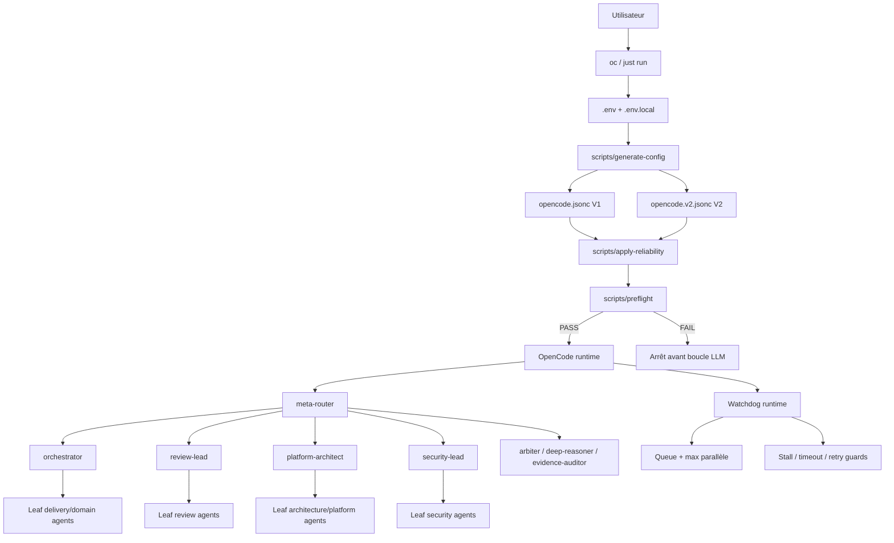
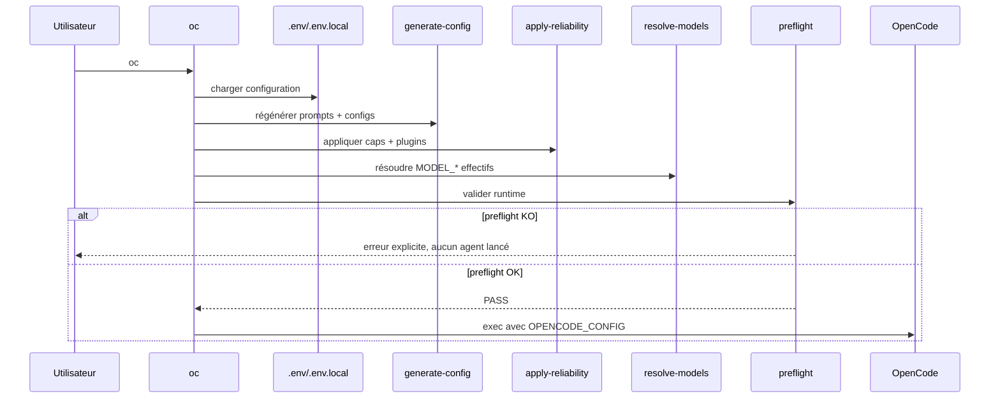
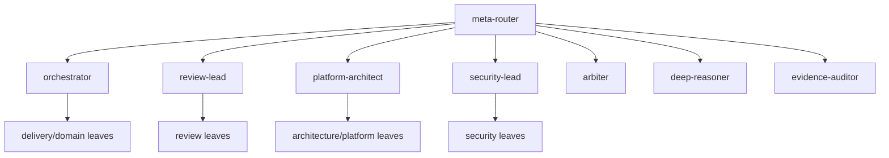
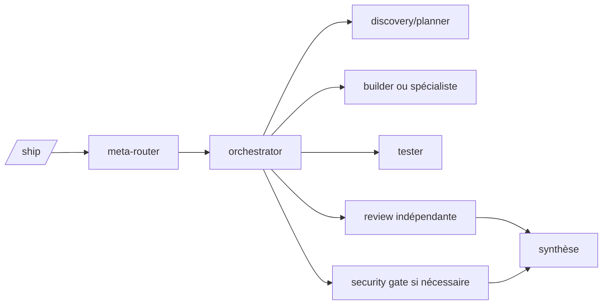
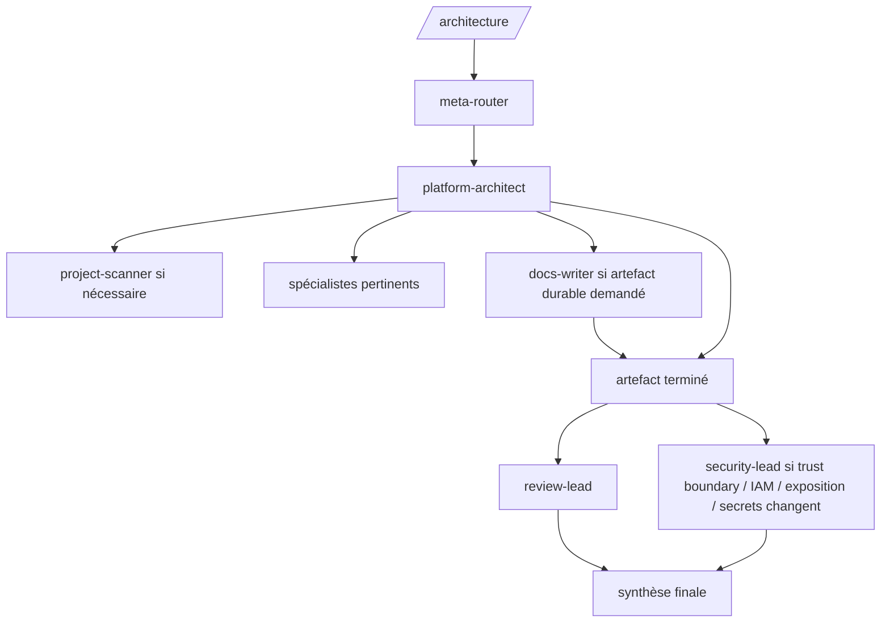
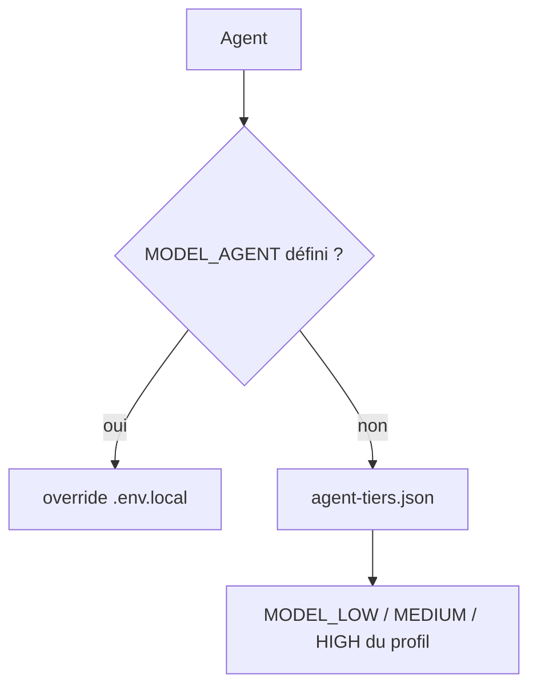
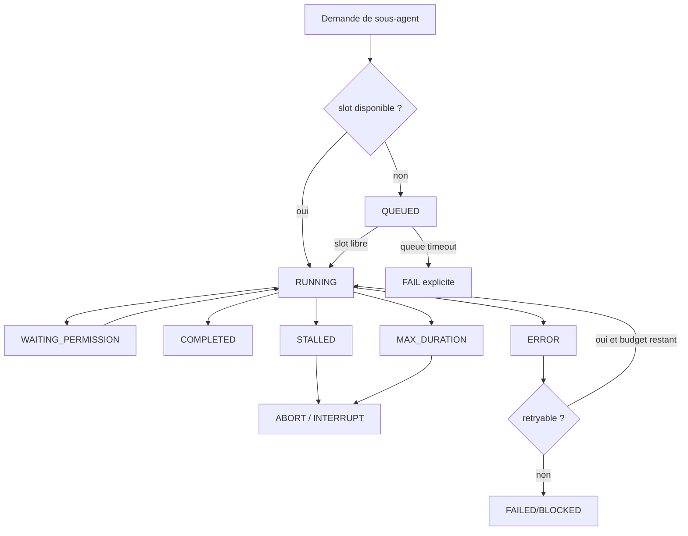

# Architecture système du OpenCode Agent Toolkit

> Ce document décrit **l'architecture interne du toolkit lui-même** : comment il démarre, génère sa configuration, route une demande, lance et supervise les sous-agents, applique les garde-fous et produit des handoffs vérifiables.
>
> Il complète `ARCHITECTURE.md`, qui décrit surtout la manière dont les agents produisent et revoient une architecture cible pour un projet.

## 1. Objectifs de conception

Le toolkit est conçu comme un **runtime multi-agent contrôlé**, et non comme une collection de prompts indépendants.

Les objectifs principaux sont :

1. **Hiérarchie explicite** : un utilisateur parle à un point d'entrée, les leads orchestrent, les leaf agents exécutent.
2. **Délégation bornée** : profondeur maximale faible, catalogues de sous-agents allowlistés, leaf agents incapables de redéléguer.
3. **Evidence first** : les décisions et affirmations importantes doivent être reliées à des fichiers, commandes, logs, métriques, plans ou sources vérifiables.
4. **Indépendance des reviews** : le producteur ne certifie pas seul son propre travail.
5. **Provider-agnostic** : les agents expriment un niveau de capacité, pas un fournisseur ou un modèle codé en dur.
6. **Fiabilité déterministe** : les limites de steps, parallélisme, retries, durée et stagnation sont appliquées par du code, pas uniquement par le prompt.
7. **Fail fast** : auth, modèle, config ou plugin manquants doivent idéalement échouer avant le premier appel LLM coûteux.
8. **Coût borné par plusieurs barrières** : steps, durée, retries, profondeur et concurrence limitent les dérives même sans télémétrie monétaire fiable.

---

## 2. Vue d'ensemble



En pratique, le toolkit possède **deux plans complémentaires** :

- le **control plane agentique**, qui décide qui travaille sur quoi ;
- le **runtime guard plane**, qui décide combien de temps, combien de fois et combien d'agents peuvent travailler simultanément.

Le premier est piloté par les prompts et permissions. Le second est volontairement déterministe.

---

## 3. Carte des composants du repository

| Chemin | Responsabilité |
|---|---|
| `agents/manifest.json` | Source de vérité fonctionnelle des rôles d'agents : description, méthode, contraintes spécifiques |
| `scripts/generate-config` | Génère les prompts et les configurations OpenCode V1/V2 depuis une source commune |
| `prompts/` | Prompts générés consommés au runtime |
| `profiles/agent-tiers.json` | Mapping agent -> tier `low` / `medium` / `high` |
| `profiles/*.env.example` | Mapping tier -> modèles concrets d'un provider/profile |
| `.env` | Profil actif et configuration locale principale |
| `.env.local` | Overrides persistants locaux, notamment modèle ou limite par agent |
| `scripts/resolve-models` | Résout les modèles effectifs pour chaque agent |
| `reliability.json` | Valeurs par défaut de fiabilité : steps, concurrence, timeouts, retries |
| `scripts/apply-reliability` | Post-traite les configs générées avec les caps et le wiring des plugins |
| `.opencode/plugins/reliability-v1.js` | Watchdog/runtime guards pour la configuration V1 |
| `.opencode/plugins/reliability-v2.ts` | Watchdog/runtime guards pour la configuration V2 |
| `scripts/preflight` | Vérifications déterministes avant démarrage d'OpenCode |
| `scripts/opencode-agents` | Launcher `oc` / `just run` |
| `contracts/*.schema.json` | Contrats machine-readable de routage et de handoff |
| `scripts/scan-projects` + scanner | Découverte multi-repository et inventaire d'architecture |
| `docs/` | Documentation utilisateur, sécurité, routing, modèles, fiabilité et architecture |
| `tests/` | Invariants de génération, permissions, installation, profils et fiabilité |

### Principe important : les fichiers générés ne sont pas la source de vérité

`prompts/`, `opencode.jsonc` et `opencode.v2.jsonc` sont dérivés de sources plus haut niveau.

La chaîne normale est :

```text
manifest + policies + profiles
          |
          v
  generate-config
          |
          v
 prompts + raw OpenCode configs
          |
          v
  apply-reliability
          |
          v
 runtime configs effectives
```

Il faut donc modifier la **source appropriée** plutôt que patcher manuellement une config générée.

---

## 4. Cycle de démarrage : ce qui se passe quand on tape `oc`

Le launcher `scripts/opencode-agents` préserve le répertoire courant du projet et résout le chemin réel du toolkit même lorsque `oc` est un symlink dans `~/.local/bin`.



### 4.1 Chargement de configuration

Ordre de surcharge :

```text
.env
  ↓
.env.local
```

`.env.local` gagne donc sur `.env` et permet de conserver des choix personnels sans modifier les fichiers versionnés.

### 4.2 Génération

`scripts/generate-config` :

- lit `agents/manifest.json` ;
- construit les prompts structurés ;
- injecte les politiques communes ;
- configure permissions et allowlists de délégation ;
- fixe la profondeur de sous-agents ;
- génère V1 et V2 depuis la même logique.

### 4.3 Post-traitement reliability

`scripts/apply-reliability` :

- réduit les `steps` selon `reliability.json` ou les variables d'environnement ;
- ajoute le plugin watchdog correspondant à V1/V2 ;
- ajoute aux leads le contrat de supervision des enfants ;
- aligne le prompt du lead avec le budget runtime de concurrence.

### 4.4 Résolution des modèles

Les agents ne portent pas un modèle concret dans leur définition fonctionnelle. Le modèle effectif est résolu séparément, voir section 10.

### 4.5 Preflight

Le preflight tente de détecter avant la boucle LLM :

- binaire OpenCode absent ;
- config absente ou JSON invalide ;
- plugin watchdog absent ou non branché ;
- valeurs reliability invalides ;
- tiers de modèles vides ;
- credentials explicitement absents ;
- modèles configurés non exposés par `opencode models` ;
- état Git inhabituel.

Le preflight ne remplace pas les contrôles runtime : certains problèmes ne sont visibles qu'au premier appel provider.

---

## 5. Control plane agentique

Le toolkit contient 37 agents, mais seuls quelques-uns forment le plan de contrôle.



### 5.1 `meta-router`

Responsabilité : **classifier la demande et sélectionner un chemin principal**.

Il ne voit pas les 37 agents comme un catalogue plat. Son catalogue est volontairement réduit aux leads et agents d'escalade.

Dimensions de routage :

- domaines ;
- complexité ;
- risque ;
- incertitude ;
- blast radius ;
- type de changement ;
- gates nécessaires ;
- escalations éventuelles.

### 5.2 `orchestrator`

Responsabilité : delivery multi-étapes, implémentation, debug et incident.

Il sélectionne les spécialistes pertinents, coordonne la progression et consomme les handoffs.

### 5.3 `review-lead`

Responsabilité : construire une **review indépendante adaptative** selon la surface modifiée.

Il ne lance pas tous les reviewers possibles : il choisit les dimensions nécessaires.

### 5.4 `platform-architect`

Responsabilité : architecture et design Platform.

Il collecte les preuves, choisit les spécialistes utiles, stabilise les décisions et peut déléguer l'écriture durable à `docs-writer`.

### 5.5 `security-lead`

Responsabilité : choisir les gates sécurité réellement pertinentes : threat model, AppSec, IaC, supply-chain, secrets ou pentest autorisé.

### 5.6 Agents d'escalade

- `arbiter` : désaccord matériel entre conclusions crédibles ;
- `deep-reasoner` : décision difficile à inverser, risque élevé ou faible confiance persistante ;
- `evidence-auditor` : affirmation de réussite insuffisamment prouvée.

---

## 6. Invariants de délégation

### 6.1 Profondeur maximale

```text
meta-router -> lead/orchestrator -> leaf
```

La profondeur intentionnelle maximale reste **2**.

### 6.2 Les leaf agents ne délèguent jamais

Chaque leaf possède un deny-all explicite sur `task` / `subagent`.

Conséquence :

```text
builder -> tester        NON
builder -> security      NON
terraform -> aws         NON
```

Seuls les agents de contrôle possèdent des allowlists de sous-agents.

### 6.3 Un lead ne fan-out pas juste parce qu'une techno existe

La présence de Terraform, Kubernetes, AWS, SQL ou Go n'est pas une raison suffisante pour lancer automatiquement tous les spécialistes associés.

Un child doit apporter une valeur distincte :

- expertise nécessaire ;
- collecte de preuves trop large/spécialisée ;
- ownership d'implémentation ou test ;
- gate indépendant ;
- résolution d'un risque ou désaccord réel.

### 6.4 Un handoff complet doit être réutilisé

Relancer un child équivalent après un handoff `COMPLETE` est interdit sauf si :

- les preuves sont incomplètes ;
- les preuves sont devenues obsolètes ;
- une contradiction est apparue ;
- le scope a matériellement changé.

Cette règle réduit le coût et évite les boucles de délégation redondantes.

---

## 7. Workflows principaux

## 7.1 Delivery `/ship`



Le chemin exact dépend du risque et de la surface modifiée. Un changement local simple ne doit pas déclencher le même fan-out qu'une migration Platform.

## 7.2 Architecture `/architecture`



Règle fondamentale : **la review finale est indépendante du producteur**.

`platform-architect` ne s'auto-certifie pas.

## 7.3 Review `/review`

`review-lead` reconstitue les preuves nécessaires et sélectionne uniquement les axes concernés : code, API contract, performance, database, AWS, Kubernetes, networking, AppSec, IaC, etc.

## 7.4 Security `/security`

`security-lead` adapte les gates au changement. Le pentest n'est activé que sur un scope explicitement autorisé et reste non destructif.

---

## 8. Contrats de données entre agents

Les sous-agents ne sont pas supposés rendre une prose libre difficile à exploiter.

Deux contrats structurants existent :

### 8.1 Routing Decision

Le contrat de routage contient notamment :

- `domains` ;
- `complexity` ;
- `risk` ;
- `uncertainty` ;
- `blast_radius` ;
- `change_type` ;
- `route` ;
- `gates` ;
- `escalation_triggers` ;
- éventuellement `parallelizable`.

### 8.2 Agent Handoff

Un child termine avec :

- `STATUS` : COMPLETE / BLOCKED / ESCALATION_REQUIRED ;
- `SUMMARY` ;
- `FACTS` ;
- `ASSUMPTIONS` ;
- `EVIDENCE` ;
- `FINDINGS` ;
- `RESIDUAL RISKS` ;
- `RECOMMENDED NEXT AGENTS` ;
- `CONFIDENCE`.

Le parent consomme ce résultat au lieu de recommencer toute l'analyse.

---

## 9. Evidence discipline

Le toolkit sépare systématiquement :

```text
FACTS
ASSUMPTIONS
RECOMMENDATIONS
```

Une preuve peut être :

- fichier + lignes ;
- sortie de commande ;
- résultat de test ;
- plan Terraform/OpenTofu/Terragrunt ;
- log ;
- métrique ;
- réponse d'une source externe ;
- artefact généré.

Les agents ne doivent pas affirmer qu'un test, plan, check runtime ou lookup a réussi sans preuve disponible.

### Pourquoi cette discipline est importante

Dans un système multi-agent, une erreur d'un agent de découverte peut devenir une hypothèse implicite pour plusieurs agents suivants. La discipline de preuve réduit cette propagation.

C'est aussi la raison pour laquelle `project-scanner`, `docs-writer`, `observability`, `finops` ou `evidence-auditor` ne sont pas systématiquement placés sur le tier de modèle le moins cher : leurs sorties deviennent des entrées de décision.

---

## 10. Abstraction des modèles

Le toolkit distingue **le rôle d'un agent** de **la puissance du modèle utilisé**.

### 10.1 Trois tiers

```text
LOW
MEDIUM
HIGH
```

Le mapping agent -> tier est stocké dans `profiles/agent-tiers.json`.

Un profil provider définit ensuite :

```text
MODEL_LOW
MODEL_MEDIUM
MODEL_HIGH
```

### 10.2 Résolution



Ordre effectif :

```text
MODEL_<AGENT>
    ↓ sinon
agent tier
    ↓
MODEL_LOW / MODEL_MEDIUM / MODEL_HIGH
```

### 10.3 Bénéfice

Changer de Copilot vers Codex/OpenAI ou un autre provider ne nécessite pas de réécrire les 37 agents. Le système conserve une politique de capacité stable et remplace seulement le mapping des tiers.

---

## 11. Runtime guard plane

Le runtime guard plane est la partie qui transforme les recommandations de prompts en limites réellement applicables.



### 11.1 Limite de parallélisme

`MAX_PARALLEL_SUBAGENTS` limite le nombre d'enfants actifs **par parent**.

Valeur par défaut : `3`.

Lorsque les slots sont pleins, le nouveau lancement attend dans une queue déterministe plutôt que de déclencher immédiatement un nouvel appel LLM.

### 11.2 Timeout de queue

`SUBAGENT_QUEUE_TIMEOUT_SECONDS` empêche la queue elle-même de devenir un blocage infini.

Valeur par défaut : `600s`.

### 11.3 Réservation des slots

Les délégations en attente réservent leur capacité de lancement. Cela évite une race où plusieurs appels simultanés observeraient tous « un slot libre » et dépasseraient la limite.

### 11.4 Détection de stagnation

Le watchdog distingue :

- `lastActivityAt` : quelque chose s'est produit ;
- `lastProgressAt` : un progrès matériel a été observé.

Un agent peut donc être actif sans progresser.

Exemple conceptuel :

```text
read -> grep -> read -> grep -> même erreur
```

Ce comportement ne doit pas rester vivant uniquement parce qu'il produit des événements.

### 11.5 Permission en attente

`WAITING_PERMISSION` est explicitement exclu de la détection de stagnation.

Le runtime ne doit pas tuer un child qui attend légitimement une décision humaine.

### 11.6 Durée maximale

`SUBAGENT_MAX_DURATION_SECONDS` coupe un enfant dépassant sa durée maximale.

Valeur par défaut : `900s`.

### 11.7 Erreurs répétées

La V1 normalise les erreurs runtime/tool et peut arrêter un child lorsqu'une même cause racine se répète au-delà du budget configuré.

### 11.8 Retry provider en V2

Politique :

```text
400 / 401 / 403 / 404 -> terminal
429                  -> retry borné
5xx                  -> retry borné
```

L'objectif est d'empêcher une erreur de configuration/auth de consommer plusieurs cycles de raisonnement inutiles.

---

## 12. Caps de steps

Les `steps` OpenCode restent une barrière fondamentale même avec le watchdog.

Le générateur possède des valeurs brutes, puis `apply-reliability` applique un cap plus conservateur depuis `reliability.json`.

Exemples de valeurs par défaut :

| Agent | Cap |
|---|---:|
| `meta-router` | 12 |
| `orchestrator` | 16 |
| `platform-architect` | 14 |
| `review-lead` | 12 |
| `security-lead` | 12 |
| `builder` | 16 |
| `terraform-terragrunt` | 14 |
| `tester` | 12 |
| fallback | 10 |

Chaque cap peut être surchargé :

```bash
MAX_STEPS_ORCHESTRATOR=12
MAX_STEPS_BUILDER=14
```

Les caps et le watchdog sont complémentaires :

- steps borne le nombre d'itérations ;
- watchdog borne le temps et la stagnation ;
- retry policy borne les erreurs provider ;
- queue borne la concurrence ;
- profondeur borne l'explosion récursive.

---

## 13. Modèle de sécurité

La sécurité repose sur plusieurs couches.

### 13.1 Least privilege par rôle

Les permissions sont générées par agent.

Un reviewer n'a pas les mêmes droits qu'un builder.

### 13.2 Lecture des secrets

Des patterns sensibles sont explicitement refusés aux lecteurs d'agents, notamment `.env`, clés privées, SSH et credentials AWS usuels.

### 13.3 Infrastructure destructive

Pour Terraform/OpenTofu/Terragrunt :

```text
fmt / validate -> autorisables
plan           -> contrôlé
apply          -> deny
destroy        -> deny
```

### 13.4 Review non editing

Les agents de review et de sécurité n'ont pas vocation à modifier silencieusement le code qu'ils auditent.

### 13.5 Pentest

Le pentest doit être explicitement autorisé, scoped et non destructif.

### 13.6 Délégation allowlistée

Un lead ne peut invoquer que les children déclarés dans son catalogue. Un leaf ne peut pas contourner cette frontière.

---

## 14. Découverte multi-repository

Le toolkit peut analyser des projets sous `PROJECTS_ROOT`, par défaut :

```text
$HOME/Projects
```

`project-scanner` est spécialement autorisé à lire cette zone, tout en conservant les exclusions de secrets.

L'inventaire produit vise à décrire :

- composants ;
- langages ;
- interfaces ;
- infrastructure ;
- ressources AWS ;
- data stores ;
- relations ;
- preuves fichier/ligne ;
- confiance.

Ce résultat sert d'entrée à l'architecture au lieu de demander au lead de redécouvrir manuellement tous les repositories.

---

## 15. Failure modes et comportement attendu

| Failure mode | Réaction attendue |
|---|---|
| Binaire OpenCode absent | preflight FAIL |
| Plugin absent/non branché | preflight FAIL |
| `0 credentials` | preflight FAIL |
| Modèle configuré absent de `opencode models` | preflight FAIL |
| 401/403 provider | stop, pas de boucle de retry |
| 429/5xx temporaire | retry borné |
| Child sans progrès | watchdog -> abort/interruption |
| Child trop long | watchdog -> abort/interruption |
| Child attend permission | état WAITING_PERMISSION, pas de kill pour stagnation |
| Trop de children | queue jusqu'à libération d'un slot |
| Queue bloquée trop longtemps | timeout explicite |
| Même tâche déjà COMPLETE | réutiliser le handoff |
| Désaccord sérieux | `arbiter` |
| Décision high-risk / low-confidence | `deep-reasoner` |
| Preuve de réussite insuffisante | `evidence-auditor` |

---

## 16. Checkpoints et reprise logique

Le toolkit encourage des frontières de phase claires :

```text
discovery
   ↓
plan
   ↓
implementation
   ↓
tests
   ↓
independent review
   ↓
security gate
```

Un child bloqué doit retourner un handoff `BLOCKED` avec les preuves déjà collectées.

L'orchestrateur doit alors prendre **une décision unique** :

1. corriger le prérequis ;
2. router une fois vers un spécialiste distinct ;
3. arrêter et remonter le blocker.

Il ne doit pas créer une chaîne infinie de sous-agents essayant la même approche.

Le système ne fournit pas encore un moteur transactionnel universel qui reprend automatiquement un workflow arbitraire après redémarrage du processus ; les handoffs et artefacts constituent aujourd'hui la frontière de reprise logique.

---

## 17. Observabilité du runtime

Aujourd'hui, le watchdog maintient surtout de l'état en mémoire à partir des événements OpenCode :

- sessions connues ;
- parent/child ;
- timestamps d'activité/progrès ;
- statut ;
- permission en attente ;
- erreurs répétées ;
- réservations de slots.

Les logs du plugin permettent d'expliquer notamment les aborts et timeouts.

Une évolution naturelle serait de produire un journal structuré par run :

```text
run-id
  agent
  parent
  model
  started_at
  completed_at
  status
  steps
  retries
  queue_wait
  abort_reason
  token/cost telemetry si disponible
```

Cette télémétrie rendrait les budgets et diagnostics encore plus précis.

---

## 18. Contrôle du coût

Le coût est actuellement contrôlé de manière indirecte mais robuste par :

1. **routing minimal suffisant** ;
2. **profondeur <= 2** ;
3. **leaf agents sans délégation** ;
4. **steps cappés** ;
5. **max parallèle** ;
6. **queue bornée** ;
7. **durée max** ;
8. **stalled timeout** ;
9. **retries bornés** ;
10. **réutilisation des handoffs COMPLETE** ;
11. **tiers de modèles configurables**.

### Pourquoi il n'y a pas encore `MAX_COST_EUR`

Un hard stop monétaire correct nécessite une donnée de coût authoritative par requête. Tous les providers/profils ne fournissent pas nécessairement cette télémétrie de façon homogène.

Le toolkit préfère donc appliquer des limites vraies et mesurables plutôt que prétendre garantir un montant calculé sur une estimation incertaine.

---

## 19. Ajouter un nouvel agent sans casser l'architecture

Workflow recommandé :

1. Ajouter le rôle dans `agents/manifest.json`.
2. Décider s'il s'agit d'un **lead** ou d'un **leaf**.
3. Par défaut, préférer un leaf sans délégation.
4. Ajouter le child uniquement aux allowlists des leads qui en ont réellement besoin.
5. Assigner un tier dans `profiles/agent-tiers.json`.
6. Ajouter un override de modèle uniquement si nécessaire.
7. Définir permissions shell/edit/web/skill minimales.
8. Choisir un cap de steps dans `reliability.json` si le fallback ne convient pas.
9. Régénérer : `just config`.
10. Ajouter ou mettre à jour les tests d'invariants.
11. Documenter le rôle dans `docs/*/AGENTS.md` si la topologie change matériellement.

### Anti-pattern

Ne pas transformer un spécialiste en mini-orchestrateur juste pour lui donner « plus d'autonomie ». Cela casse l'invariant de profondeur et rend le coût difficile à borner.

---

## 20. Ajouter ou changer un provider/modèle

La bonne frontière est le profil, pas le manifest des agents.

```text
nouveau provider
      ↓
profiles/<provider>.env.example
      ↓
MODEL_LOW / MODEL_MEDIUM / MODEL_HIGH
      ↓
37 agents inchangés
```

Pour un besoin très spécifique :

```bash
MODEL_BUILDER=<provider/model>
MODEL_REVIEWER=<provider/model>
```

à placer dans `.env.local`.

---

## 21. Modifier une règle de fiabilité

### Valeur globale

Modifier `reliability.json` si la nouvelle valeur doit devenir le défaut versionné.

### Valeur personnelle

Utiliser `.env.local` :

```bash
MAX_PARALLEL_SUBAGENTS=2
SUBAGENT_QUEUE_TIMEOUT_SECONDS=300
SUBAGENT_STALLED_TIMEOUT_SECONDS=120
MAX_PROVIDER_RETRIES=1
MAX_STEPS_ORCHESTRATOR=12
```

### Validation

```bash
just reliability
just preflight
just doctor
just check
```

---

## 22. Invariants testés

Les tests servent de garde d'architecture, pas seulement de tests unitaires techniques.

Ils vérifient notamment :

- même ensemble d'agents V1/V2 ;
- profondeur bornée ;
- leaf agents sans délégation ;
- permissions sensibles ;
- agents autorisés à éditer ;
- deny des commandes Terraform destructives ;
- présence des contrats dans les prompts ;
- économie de délégation des leads ;
- caps de reliability ;
- plugins watchdog chargés ;
- présence de la queue et de son timeout ;
- intégration du launcher par symlink ;
- parité des profils de modèles.

Ainsi, une modification qui casse un invariant du control plane doit échouer en CI.

---

## 23. Limites connues

1. **Pas encore de budget monétaire hard-stop universel** faute de télémétrie provider homogène.
2. **La notion de progrès est heuristique** : les événements disponibles ne décrivent pas toujours parfaitement la valeur du travail effectué.
3. **Le watchdog dépend des événements et API OpenCode de chaque version** ; V1 et V2 ont donc deux implémentations distinctes.
4. **La queue est in-process** : elle ne constitue pas un scheduler distribué persistant.
5. **Les handoffs offrent une reprise logique**, mais pas encore un moteur de workflow durable/transactionnel complet.
6. **Le preflight peut seulement vérifier ce qui est observable localement** ; une erreur provider peut encore apparaître après démarrage.
7. **Le parallélisme élevé reste coûteux** même lorsqu'il est techniquement contrôlé.

---

## 24. Comment lire le toolkit dans le code

Ordre conseillé pour comprendre l'implémentation :

```text
1. docs/fr/SYSTEM_ARCHITECTURE.md   <- ce document
2. agents/manifest.json             <- rôles
3. scripts/generate-config          <- compilation agent -> OpenCode
4. profiles/agent-tiers.json        <- capacité modèle
5. reliability.json                 <- limites runtime
6. scripts/apply-reliability        <- post-traitement
7. scripts/opencode-agents          <- boot path
8. scripts/preflight                <- fail-fast
9. .opencode/plugins/reliability-*  <- supervision runtime
10. contracts/*.schema.json         <- interfaces entre agents
11. tests/                           <- invariants exécutables
```

Puis approfondir avec :

- `AGENTS.md` : catalogue et hiérarchie des agents ;
- `ROUTING.md` : décisions de routage ;
- `MODEL_STRATEGY.md` : tiers et providers ;
- `RELIABILITY.md` : détail des garde-fous ;
- `SECURITY.md` : politiques de sécurité ;
- `ARCHITECTURE.md` : workflow de production/review d'architecture cible ;
- `PROJECT_DISCOVERY.md` : inventaire multi-repository.

---

## 25. Résumé mental en une page

Si tu dois retenir uniquement le fonctionnement essentiel :

```text
                       USER
                        |
                        v
                  oc / just run
                        |
         +--------------+--------------+
         |                             |
         v                             v
  config/model pipeline         reliability pipeline
         |                             |
         +--------------+--------------+
                        |
                     preflight
                        |
                        v
                     OpenCode
                        |
                        v
                   meta-router
                        |
        +---------------+---------------+
        |               |               |
        v               v               v
  orchestrator    platform-architect  review/security
        |               |               |
        +---------------+---------------+
                        |
                   leaf agents
                        |
                        v
                 evidence + handoff

Runtime autour de tout cela :
- profondeur <= 2
- leaf delegation = deny
- steps cappés
- max N children actifs
- queue déterministe
- queue timeout
- stalled timeout
- max duration
- retries bornés
- WAITING_PERMISSION != STALLED
- review indépendante
```

Le principe directeur est :

> **Les LLM choisissent et exécutent le travail d'ingénierie ; le code déterministe contrôle leurs frontières, leur concurrence, leurs retries et leur durée.**
