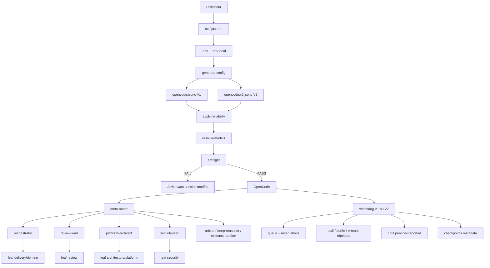
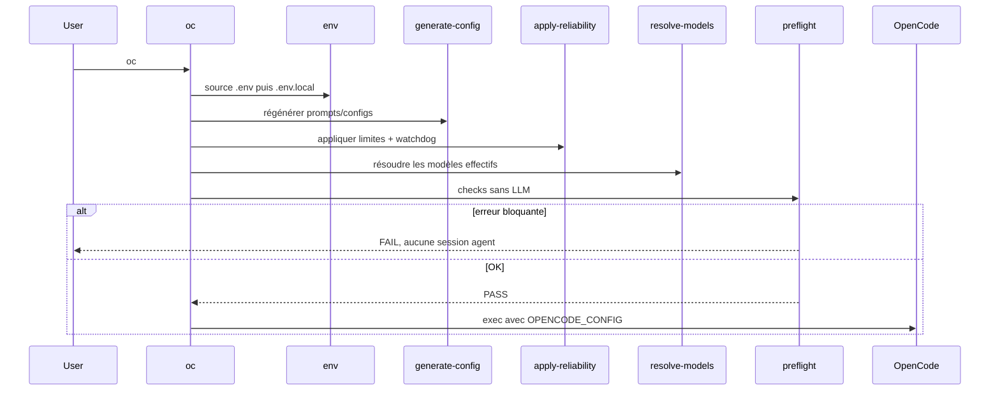
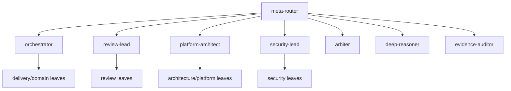
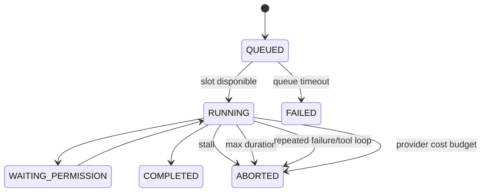

# Architecture système du OpenCode Agent Toolkit

> Ce document décrit **l'architecture interne du toolkit lui-même** : boot, génération de configuration, routage, hiérarchie des agents, modèles, supervision des sous-agents, garde-fous de coût et reprise logique.
>
> `ARCHITECTURE.md` décrit un autre sujet : la manière dont les agents produisent et revoient l'architecture d'un projet.

## 1. Idée directrice

Le toolkit est un **runtime multi-agent contrôlé**, pas une collection de prompts indépendants.

La séparation fondamentale est :

```text
              OpenCode Agent Toolkit
                       |
          +------------+------------+
          |                         |
          v                         v
  AGENT CONTROL PLANE       RUNTIME GUARD PLANE
          |                         |
   Qui fait quoi ?          Combien / combien
                            de temps / retries ?
          |                         |
   meta-router                 preflight
   orchestrator                step caps
   review-lead                 watchdog
   architect                   queue
   security                    max parallel
                               timeouts
                               cost guards
                               checkpoints
```

**Les LLM décident du travail d'ingénierie. Le code déterministe décide de leurs frontières opérationnelles.**

Objectifs principaux :

1. hiérarchie explicite et peu profonde ;
2. délégation allowlistée ;
3. leaf agents incapables de redéléguer ;
4. décisions basées sur des preuves ;
5. reviews indépendantes ;
6. modèles interchangeables par tiers de capacité ;
7. échec rapide avant le premier appel coûteux quand possible ;
8. steps, durée, retries, profondeur et concurrence bornés ;
9. conservation des métadonnées utiles en cas d'abort ;
10. contrôle de coût uniquement à partir de télémétrie réellement remontée.

---

## 2. Vue d'ensemble



---

## 3. Sources de vérité du repository

| Chemin | Responsabilité |
|---|---|
| `agents/manifest.json` | définition fonctionnelle des agents |
| `scripts/generate-config` | compilation manifest/policies vers prompts + configs V1/V2 |
| `profiles/agent-tiers.json` | mapping agent -> `LOW` / `MEDIUM` / `HIGH` |
| `profiles/*.env.example` | mapping tiers -> modèles concrets |
| `.env` | profil/configuration locale principale |
| `.env.local` | overrides personnels persistants |
| `reliability.json` | profils et limites runtime versionnées |
| `scripts/apply-reliability` | caps de steps, wiring watchdog, supervision des leads |
| `.opencode/plugins/reliability-v1.js` | runtime guard plane OpenCode V1 |
| `.opencode/plugins/reliability-v2.ts` | runtime guard plane OpenCode V2 |
| `scripts/preflight` | vérifications zéro-token avant lancement |
| `contracts/*.schema.json` | contrats de routage et handoff |
| `tests/` | invariants exécutables du système |

`prompts/`, `opencode.jsonc` et `opencode.v2.jsonc` sont **générés**. Ils ne doivent pas être considérés comme la source de vérité à éditer manuellement.

```text
manifest + profiles + policies
             |
             v
       generate-config
             |
             v
    prompts + raw configs
             |
             v
      apply-reliability
             |
             v
      configs effectives
```

---

## 4. Ce qui se passe quand tu tapes `oc`

`scripts/opencode-agents` est le point d'entrée opérationnel.



Le launcher résout son vrai chemin même lorsqu'il est appelé via le symlink `~/.local/bin/oc`, tout en conservant le répertoire courant comme workspace du projet.

### Ordre des overrides

```text
.env
  ↓
.env.local
```

`.env.local` gagne. Il sert donc aux choix personnels : modèle d'un agent, profil reliability, parallélisme, timeouts, etc.

---

## 5. Control plane agentique

Le toolkit contient 37 agents mais seulement quelques agents de contrôle.



### `meta-router`

Classifie la demande et choisit un chemin principal. Il ne voit volontairement pas un catalogue plat de 37 spécialistes.

### `orchestrator`

Pilote delivery, fix, debug et incident multi-étapes.

### `review-lead`

Sélectionne les dimensions d'une review indépendante selon la surface réellement modifiée.

### `platform-architect`

Pilote les travaux d'architecture et choisit uniquement les spécialistes Platform pertinents.

### `security-lead`

Sélectionne les gates nécessaires : threat-model, AppSec, IaC security, supply-chain, secrets, pentest autorisé, etc.

### Escalade

- `arbiter` : conclusions crédibles mais contradictoires ;
- `deep-reasoner` : décision high-risk, difficile à inverser ou faible confiance persistante ;
- `evidence-auditor` : affirmation de réussite non suffisamment prouvée.

---

## 6. Invariants de délégation

### Profondeur

```text
meta-router -> lead/orchestrator -> leaf
```

Profondeur intentionnelle maximale : **2**.

### Leaf agents

Les leaf agents ont un deny explicite sur `task` / `subagent`.

```text
builder -> tester        NON
terraform -> aws         NON
reviewer -> appsec       NON
```

La coordination reste donc dans le control plane.

### Délégation minimale suffisante

La présence de Terraform, Go, Kubernetes ou AWS dans un repo ne justifie pas automatiquement le lancement de tous les spécialistes associés. Un child doit apporter une valeur distincte.

### Handoff réutilisable

Un handoff `COMPLETE` ne doit pas être recalculé sauf preuve obsolète, incomplète, contradictoire ou changement matériel de scope.

---

## 7. Workflows principaux

### Delivery `/ship`

```text
meta-router
    ↓
orchestrator
    ├─ discovery/planner si nécessaire
    ├─ builder ou spécialiste
    ├─ tester
    ├─ review indépendante
    └─ gate sécurité si pertinent
```

### Architecture `/architecture`

```text
platform-architect
    ├─ project-scanner si nécessaire
    ├─ spécialistes Platform pertinents
    └─ docs-writer si artefact durable
              ↓
        artefact terminé
          ├─ review-lead
          └─ security-lead si nécessaire
```

Le producteur ne certifie jamais seul sa propre architecture.

### `/review`

`review-lead` reconstruit les preuves puis sélectionne code/API/performance/database/AWS/Kubernetes/networking/security selon la surface du changement.

### `/security`

`security-lead` adapte le contrôle au risque réel. Les pentests doivent être explicitement autorisés, scoped et non destructifs.

---

## 8. Contrats entre agents

Les agents utilisent deux contrats structurants sous `contracts/`.

### Routing decision

Décrit notamment : domaines, complexité, risque, incertitude, blast radius, type de changement, route, gates, escalations et parallélisabilité.

### Agent handoff

Un child doit distinguer :

```text
STATUS
SUMMARY
FACTS
ASSUMPTIONS
EVIDENCE
FINDINGS
RESIDUAL RISKS
RECOMMENDED NEXT AGENTS
CONFIDENCE
```

Le parent consomme le handoff au lieu de refaire le travail depuis zéro.

---

## 9. Discipline de preuve

Le toolkit sépare systématiquement :

```text
FACTS
ASSUMPTIONS
RECOMMENDATIONS
```

Une preuve peut être un fichier/ligne, une commande, un test, un plan Terraform, un log, une métrique, une source externe ou un artefact généré.

Cette discipline est importante dans un système multi-agent : une mauvaise hypothèse produite tôt peut sinon être amplifiée par plusieurs agents en aval.

---

## 10. Abstraction des modèles

Un agent exprime un **tier de capacité**, pas un fournisseur figé.

```text
MODEL_<AGENT> override
        ↓ sinon
profiles/agent-tiers.json
        ↓
MODEL_LOW / MODEL_MEDIUM / MODEL_HIGH
```

Ainsi, changer Copilot vers Codex/OpenAI ou un autre provider ne nécessite pas de réécrire les agents.

Le preflight vérifie les **modèles réellement résolus pour les agents**, y compris les placeholders `{env:MODEL_*}` des configs générées.

---

## 11. Runtime guard plane

V1 et V2 possèdent chacun un watchdog adapté à leur API, mais visent la même sémantique.



Le watchdog suit chaque child indépendamment de la session racine.

---

## 12. Profils reliability

`reliability.json` contient trois profils :

| Profil | Parallèle | Queue | Stall | Durée child | Retries | Child cost* | Run cost* |
|---|---:|---:|---:|---:|---:|---:|---:|
| `cheap` | 2 | 300s | 120s | 600s | 1 | 0.25 | 1.00 |
| `normal` | 3 | 600s | 180s | 900s | 2 | 0.50 | 2.00 |
| `premium` | 4 | 900s | 240s | 1200s | 2 | 1.50 | 5.00 |

`*` = valeur remontée par OpenCode/provider, dans son unité native.

```bash
RELIABILITY_PROFILE=normal
```

Les variables explicites de `.env.local` prennent le dessus sur le profil.

---

## 13. Parallélisme et queue

### Global

```bash
MAX_PARALLEL_SUBAGENTS=3
```

### Par lead

```bash
MAX_PARALLEL_META_ROUTER=2
MAX_PARALLEL_ORCHESTRATOR=3
MAX_PARALLEL_REVIEW_LEAD=3
MAX_PARALLEL_PLATFORM_ARCHITECT=3
MAX_PARALLEL_SECURITY_LEAD=2
```

Lorsqu'aucune limite spécifique n'est définie, la limite globale est utilisée.

### Pourquoi il y a des réservations

Le runtime doit protéger contre deux problèmes opposés :

1. **race** : plusieurs lancements observent simultanément le même slot libre ;
2. **double comptage** : un lancement devient un child réel mais reste encore compté comme pending.

La solution actuelle :

```text
tool delegation
     ↓
reservation(callID)
     ↓
child apparaît via event ou session.children()
     ↓
reservation correspondante consommée
     ↓
child compté comme actif
```

La réconciliation `session.children()` complète les événements OpenCode lorsque nécessaire.

Si tous les slots sont utilisés, le tool attend côté runtime. Cette attente ne déclenche pas un appel LLM juste pour patienter.

---

## 14. Activité, progrès et stagnation

Le watchdog maintient deux notions distinctes :

```text
lastActivityAt
lastProgressAt
```

Un agent peut être très actif sans progresser :

```text
read -> grep -> read -> grep -> même erreur
```

`WAITING_PERMISSION` est explicitement exclu du stall : attendre une décision humaine n'est pas un blocage logique.

---

## 15. Boucles et erreurs répétées

Le runtime normalise les erreurs afin que des IDs ou durées variables ne masquent pas la même cause racine.

Il mémorise également les appels outils. Le motif suivant devient détectable :

```text
même tool + mêmes args -> même résultat
même tool + mêmes args -> même résultat
même tool + mêmes args -> même résultat
```

Au-delà de `MAX_SAME_ERROR`, le child peut être interrompu.

V2 ajoute une politique de retry provider :

```text
400 / 401 / 403 / 404 -> terminal
429                  -> retry borné
5xx                  -> retry borné
```

---

## 16. Budgets de coût

Le toolkit peut maintenant appliquer :

```bash
MAX_CHILD_COST=0.50
MAX_RUN_COST=2.00
```

Ces valeurs ne sont **pas des euros estimés par le toolkit**. Elles utilisent uniquement le coût réellement remonté par OpenCode/provider.

- `MAX_CHILD_COST` : interrompt un child au-dessus du budget remonté ;
- `MAX_RUN_COST` : interrompt la famille de sessions lorsque le total remonté dépasse la limite ;
- `0` : désactive la limite monétaire correspondante.

Si le provider ne remonte aucun coût exploitable, le toolkit **n'invente pas de montant**. Les autres barrières restent actives : steps, durée, stall, retries, profondeur et concurrence.

---

## 17. Checkpoints

Le watchdog persiste des **métadonnées**, pas le prompt ni le code source :

```text
${XDG_STATE_HOME:-$HOME/.local/state}/opencode-agent-toolkit/runs/<session-id>.json
```

Override :

```bash
RELIABILITY_STATE_DIR=/chemin/personnalise
```

Un checkpoint contient :

- session ID ;
- parent ;
- agent si connu ;
- statut ;
- raison d'abort ;
- coût remonté ;
- timestamps de démarrage, activité et progrès.

La session OpenCode, les handoffs et les artefacts restent la source de vérité pour le contenu détaillé. Le toolkit ne prétend donc pas être un moteur de workflow transactionnel distribué.

---

## 18. Caps de steps

Les steps sont une barrière indépendante du watchdog.

Exemples de caps versionnés :

| Agent | Cap |
|---|---:|
| `meta-router` | 12 |
| `orchestrator` | 16 |
| `platform-architect` | 14 |
| `review-lead` | 12 |
| `security-lead` | 12 |
| `builder` | 16 |
| `terraform-terragrunt` | 14 |
| `tester` | 12 |
| fallback | 10 |

Un override peut **réduire**, jamais augmenter le plafond versionné :

```text
steps effectifs = min(steps générés, cap reliability versionné, override local)
```

Ainsi :

```bash
MAX_STEPS_BUILDER=7    # builder -> 7
MAX_STEPS_BUILDER=999  # builder reste <= 16
```

---

## 19. Preflight

Le preflight s'exécute sans appel LLM et tente de bloquer avant le premier token coûteux :

- binaire OpenCode absent ;
- config invalide ;
- plugin V1/V2 absent ou non branché ;
- profil reliability invalide ;
- limites numériques invalides ;
- credentials explicitement absents pour un provider connu ;
- modèle résolu non exposé par `opencode models` ;
- configuration Git inhabituelle.

```bash
OPENCODE_PREFLIGHT=1
OPENCODE_PREFLIGHT_AUTH=1
OPENCODE_PREFLIGHT_MODELS=1
# OPENCODE_PREFLIGHT_STRICT=1
```

Le script reste compatible avec le Bash 3 livré par défaut sur macOS.

---

## 20. Modèle de sécurité

La sécurité repose sur plusieurs couches :

- least privilege par agent ;
- secrets et chemins sensibles refusés aux lecteurs ;
- Terraform/OpenTofu/Terragrunt destructif refusé ;
- reviewers/security non-editing ;
- pentest explicitement autorisé et non destructif ;
- délégation allowlistée ;
- profondeur bornée ;
- review indépendante.

---

## 21. Découverte multi-repository

`PROJECTS_ROOT` vaut par défaut :

```text
$HOME/Projects
```

Le scanner produit un inventaire de composants, langages, interfaces, infrastructure, ressources AWS, stores de données, relations, preuves fichier/ligne et confiance.

Cet inventaire évite aux agents d'architecture de redécouvrir manuellement chaque repository.

---

## 22. Failure modes

| Failure mode | Réaction |
|---|---|
| OpenCode absent | preflight FAIL |
| watchdog absent/non branché | preflight FAIL |
| auth explicitement absente | preflight FAIL |
| modèle configuré indisponible | preflight FAIL |
| 401/403/400/404 provider | terminal |
| 429/5xx | retry borné |
| limite parallèle atteinte | queue |
| queue trop longue | timeout explicite |
| child sans progrès | abort/interruption |
| child trop long | abort/interruption |
| même erreur répétée | abort possible |
| même tool/args/résultat répété | abort possible |
| child au-dessus du coût remonté | abort si télémétrie disponible |
| permission humaine attendue | `WAITING_PERMISSION`, pas stall |
| même tâche déjà COMPLETE | réutiliser le handoff |
| désaccord matériel | `arbiter` |
| high-risk / low-confidence | `deep-reasoner` |
| preuve insuffisante | `evidence-auditor` |

---

## 23. Ajouter un agent

1. modifier `agents/manifest.json` ;
2. décider lead ou leaf — leaf par défaut ;
3. garder la délégation interdite aux leafs ;
4. ajouter le child uniquement aux leads nécessaires ;
5. assigner un tier dans `profiles/agent-tiers.json` ;
6. définir permissions minimales ;
7. ajouter un cap de steps si le fallback ne convient pas ;
8. régénérer ;
9. ajouter des tests d'invariant ;
10. mettre à jour la documentation si la topologie change.

Anti-pattern : transformer chaque spécialiste en mini-orchestrateur.

---

## 24. Ajouter/changer un provider

La frontière correcte est le profil de modèles :

```text
profiles/<provider>.env.example
          ↓
MODEL_LOW / MODEL_MEDIUM / MODEL_HIGH
          ↓
agents inchangés
```

Les exceptions persistantes restent dans `.env.local` :

```bash
MODEL_BUILDER=<provider/model>
MODEL_REVIEWER=<provider/model>
```

---

## 25. Modifier la reliability

Défaut versionné : `reliability.json`.

Override personnel : `.env.local`.

Exemple :

```bash
RELIABILITY_PROFILE=normal
MAX_PARALLEL_SUBAGENTS=3
MAX_PARALLEL_SECURITY_LEAD=2
SUBAGENT_STALLED_TIMEOUT_SECONDS=180
MAX_CHILD_COST=0.50
MAX_RUN_COST=2.00
MAX_STEPS_ORCHESTRATOR=12
```

Validation :

```bash
just reliability
just preflight
just doctor
just check
```

---

## 26. Limites connues

1. Le budget de coût dépend de la télémétrie réellement remontée par le provider ; il n'existe pas de conversion EUR universelle inventée par le toolkit.
2. La notion de progrès reste heuristique : tous les événements ne reflètent pas parfaitement la valeur du travail.
3. V1 et V2 nécessitent deux implémentations de watchdog, même si leurs invariants doivent rester alignés.
4. La queue est in-process, pas un scheduler distribué persistant.
5. Les checkpoints sont des métadonnées ; ils ne constituent pas un moteur transactionnel de reprise complète.
6. Le preflight ne peut vérifier que ce qui est observable avant l'appel provider.
7. Un parallélisme élevé reste coûteux même lorsqu'il est contrôlé.

---

## 27. Ordre de lecture du code

```text
1. docs/fr/SYSTEM_ARCHITECTURE.md
2. agents/manifest.json
3. scripts/generate-config
4. profiles/agent-tiers.json
5. reliability.json
6. scripts/apply-reliability
7. scripts/opencode-agents
8. scripts/preflight
9. .opencode/plugins/reliability-v1.js
10. .opencode/plugins/reliability-v2.ts
11. contracts/*.schema.json
12. tests/
```

Puis : `AGENTS.md`, `ROUTING.md`, `MODEL_STRATEGY.md`, `RELIABILITY.md`, `SECURITY.md`, `ARCHITECTURE.md`, `PROJECT_DISCOVERY.md`.

---

## 28. Résumé mental

```text
USER
 |
 v
oc
 |
 +--> config generation
 +--> model resolution
 +--> reliability caps
 +--> preflight
 |
 v
OpenCode
 |
 v
meta-router
 |
 +--> orchestrator
 +--> platform-architect
 +--> review-lead
 +--> security-lead
 +--> escalation agents
 |
 v
leaf agents
 |
 v
evidence + structured handoffs

Autour de tout le runtime :
- depth <= 2
- leaf delegation = deny
- step caps
- reliability profiles
- max parallel global + per lead
- queue + reservations + session.children reconciliation
- stall + max duration
- repeated failure/tool-loop detection
- bounded provider retries
- provider-reported cost budgets when available
- metadata checkpoints
- WAITING_PERMISSION != STALLED
- independent review
```
